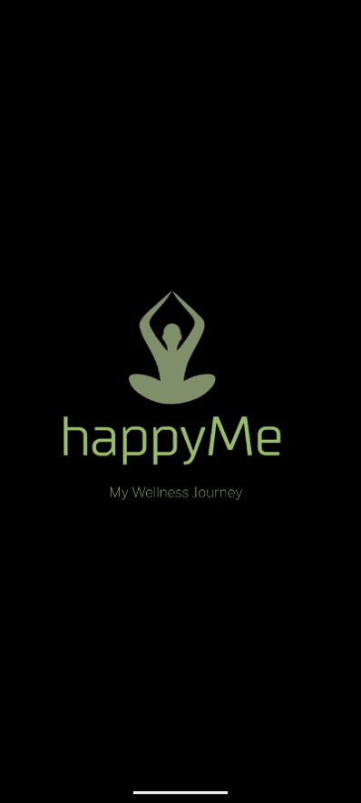
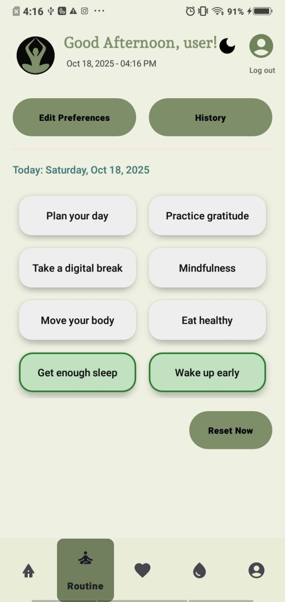
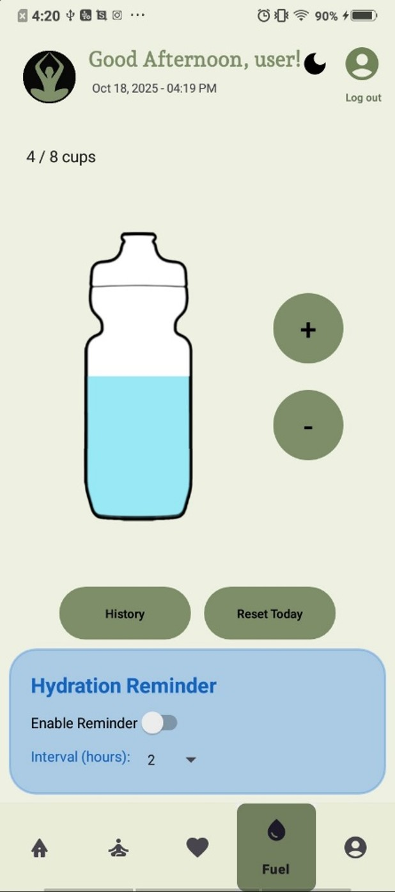
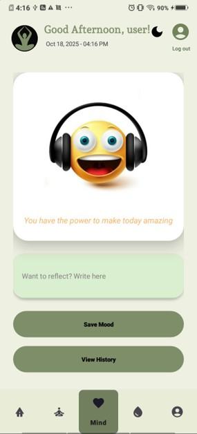
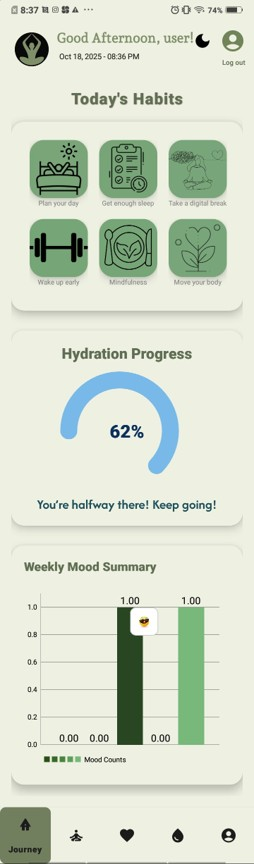
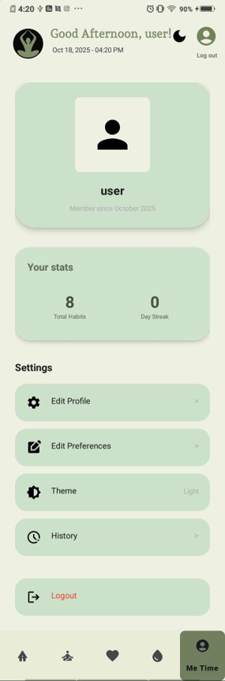
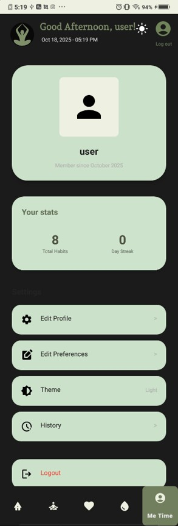

# HappyMe - Habit Tracker & Wellness App 


HappyMe is a personal wellness Android application designed to help users build and maintain healthy routines through habit tracking, mood monitoring, hydration management, and insightful progress reports.

All data is stored locally on the device, ensuring complete privacy. The app delivers a calm, motivating, and seamless experience to support long-term self-improvement.

---

## Features

### Home Dashboard
- Personalized greeting
- Daily habit checklist (completed habits auto-hide)
- Motivational quotes
- Water intake progress
- 7-day mood summary chart

### Routine Management
- Add, edit, delete & complete habits
- Habit history & statistics
- Personalized onboarding
- PDF progress report generation

### Mind Tracking
- Record daily moods + personal reflections
- Mood history & pattern visualization
- PDF mood reports

### Fuel Tracker
- Interactive 8-cup hydration tracker
- Add/remove intake with goal tracking
- Reminder notifications
- Automatic daily reset at midnight

### MeTime Profile
- Wellness statistics & habit streaks
- Light / Dark Mode
- Preference management
- Secure logout

---

## Tech Stack

- **Language**: Kotlin
- **UI**: XML
- **Architecture**: MVVM + Repository Pattern, Single Activity + Fragments
- **Database**: Room Database + SharedPreferences
- **Async**: Kotlin Coroutines + Flow
- **Tools**: Android Studio
- **Features**: PDF Generation, Local Notifications, Dark Mode

---

## Installation & Setup

### Prerequisites
- Android Studio
- Android SDK (API Level 24 or higher)

### Steps to Run the Project

1. **Clone the repository**
   ```bash
   git clone https://github.com/Ishoda/Habbit_Tracker.git
   
2.**Open in Android Studio**
Open the project and sync Gradle files

3.**Run the app**
Connect a device or start an emulator
Click the Run button (▶️)

---


## Architecture

textFragments (UI) → ViewModel → Repository → Room DB / SharedPreferences
The app follows MVVM architecture with clean separation of concerns and real-time updates using Kotlin Flow.

---

##  Screenshots

               
    

---

## Key Challenges & Learnings

- Designed a clean and intuitive wellness-focused UI/UX
- Implemented local data persistence using Room Database
- Managed multiple features with MVVM architecture
- Integrated PDF generation and local notifications

---

**Key Learnings**:
- Modern Android development practices with Kotlin
- MVVM architecture and clean code principles
- Efficient local data management with Room, Coroutines & Flow

---

## Project Links
- **Report 01**: [Download PDF](Documentation/lab3.pdf)
- **Report 02**: [Download PDF](Documentation/lab4.pdf)

---

**Author**  
**Ishoda Moderage**  
BSc (Hons) Information Technology, Specializing in Data Science  
Sri Lanka Institute of Information Technology (SLIIT)
